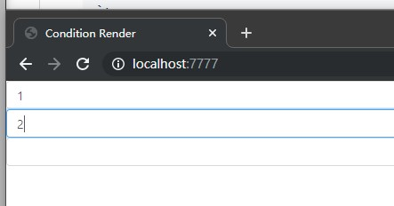

# condition-render | 条件渲染

## Intro | 简介

> Based on cpmcept of AOP, React json-schema render tool, Useful for large of
> forms. efficient, flexible and easy to expand.
> Its predecessor was [antd-form-gen](https://www.npmjs.com/package/antd-form-gen)
>
> 基于 AOP 思想, 用 JSON 格式渲染组件的工具。特别在大量表单的场景下，显得高效灵活、易扩
> 展。
> 它的前身是[antd-form-gen](https://www.npmjs.com/package/antd-form-gen)

- [condition\-render | 条件渲染](#condition-render--%E6%9D%A1%E4%BB%B6%E6%B8%B2%E6%9F%93)
  - [Intro | 简介](#intro--%E7%AE%80%E4%BB%8B)
  - [Usage | 用法](#usage--%E7%94%A8%E6%B3%95)
    - [Install | 安装](#install--%E5%AE%89%E8%A3%85)
    - [Import | 引入](#import--%E5%BC%95%E5%85%A5)
  - [Example | 例子](#example--%E4%BE%8B%E5%AD%90)
    - [Step1 simple render | 第一步 牛刀小试](#step1-simple-render--%E7%AC%AC%E4%B8%80%E6%AD%A5-%E7%89%9B%E5%88%80%E5%B0%8F%E8%AF%95)
  - [Step2 format and validation | 第二步 格式化和校验](#step2-format-and-validation--%E7%AC%AC%E4%BA%8C%E6%AD%A5-%E6%A0%BC%E5%BC%8F%E5%8C%96%E5%92%8C%E6%A0%A1%E9%AA%8C)
  - [Api | 接口](#api--%E6%8E%A5%E5%8F%A3)
    - [condition](#condition)

## Usage | 用法

### Install | 安装

```bash
npm i condition-render -S
or
yarn add condition-render -S
```

### Import | 引入

```javascript
import conditionRender from 'condition-render';
```

## Example | 例子

### Step1 simple render | 第一步 牛刀小试

let us create three native `<input/>` tags following:
我们先搞三个`<input />` 标签看看, 如下:

```js
import React from 'react';
import { render } from 'react-dom';
import conditionRender from 'condition-render';

function App() {
  const condition = [
    <input value={1} />,
    <input value={2} />,
    <input value={3} />,
  ];
  return conditionRender(condition);
}

render(<App />, document.getElementById('root'));
```


replace native `<input />` with Antd [Input][input]
用 Antd 的 [Input][input-cn] 组件代替原生`<input/>`

```js
import React from "react";
import { render } from "react-dom";
import conditionRender from "condition-render";
import { Input } from "antd";
import "antd/dist/antd.css";

function App() {
  const condition = [
    {
      "@component": <Input />,
      "@props" { value: 1 },
    },
    <Input value={2} />,
    Input
  ];
  return conditionRender(condition);
}

render(<App />, document.getElementById("root"));
```



You may have noticed that condition can be Object, Array, React Element,
React Component, or even a Function, let's continue.
你也许注意到, condition 可以是 Object、 Array、 React Element、 React Component,
其实它还可以是一个 Function, 让我们继续。

## Step2 format and validation | 第二步 格式化和校验

Usually we need to do some format and validation.
通常我们需要做一些排版和校验.
We use Antd's Col Row [component][grid] for format and [rc-form][rc-form] for validation
我们用 Antd 的 Col Row[组件][grid-cn]来排版并用 [rc-form][rc-form] 来校验

```js
import React, { useMemo } from 'react';
import { render } from 'react-dom';
import conditionRender from 'condition-render';
import { Input, Form, Col, Row } from 'antd';
import 'antd/dist/antd.css';

function App({ form }) {
  const { getFieldDecorator } = form;
  const condition = {
    // This is the wrapper around the current component,
    // it's outside of @decorator, and only applies to the current scope
    // 这是当前组件的外包装， 一定在@decorator外面，且只作用于当前层
    '@wrap': [<Form />, <Row gutter={8} />],
    // Here are the decorators will applies to each leaf components
    // 这里的装饰器会作用于每一个叶组件
    // It can be a decorator or component
    // 可以是一个装饰器或组件
    // The priority of the decorator function must be greater than the component
    // 装饰器函数的优先级一定大于组件
    '@decorator': [
      <Col span={8} />,
      // target is leaf Component , params is It's attribute
      // target 是 叶组件， params是它的参数
      (target, params) => {
        const { title } = params;
        return <Form.Item label={title}>{target}</Form.Item>;
      },
      (target, params) => {
        const { title, value } = params;
        return getFieldDecorator(title, {
          initialValue: value,
          rules: [{ required: true, message: `please input ${title}` }],
        })(target);
      },
    ],
    '@component': [
      {
        '@component': Input,
        value: 1,
        title: 'Input1',
      },
      {
        '@component': Input,
        value: 2,
        title: 'Input2',
      },
      {
        '@component': Input,
        value: 3,
        title: 'Input3',
      },
    ],
  };

  return conditionRender(condition);
}

const WithForm = Form.create()(App);

render(<WithForm />, document.getElementById('root'));
```


Now let's make it be a Modal
现在我们把它变成一个弹窗

```js
// import it
// 先引入它
import { Input, Form, Col, Row, Modal } from 'antd';
const condition = {
  // And then add it here
  // 然后再这里添加
  '@wrap': [<Modal visible={true} />, <Form />, <Row gutter={8} />],
};
```

Done.
完成了。


## Api | 接口

### condition

| 属性 Property | 描述 Property                                                                                                | 类型 Type                                                       |
| ------------- | ------------------------------------------------------------------------------------------------------------ | --------------------------------------------------------------- |
| @wrap         | component 的外包装，只作用于当前组件<br/>The wrapper of component, which only scope on the current component | `decorator function` `react class` `component`                  |
| @decorator    | component 的装饰器，只作用于叶组件<br/>The decorator of component, which only scope on the leaf component    | `decorator function` `react class` `component`                  |
| @component    | react 组件<br/>react component                                                                               | `function` `react class` `component` `array` `condition object` |
| @props        | 会注入它下面每个组件<br/>will inject each component following it                                             | `object`                                                        |

[rc-form]: https://www.npmjs.com/package/rc-form
[grid-cn]: https://ant.design/components/grid-cn/
[grid]: https://ant.design/components/grid/
[input-cn]: https://ant.design/components/input-cn/
[input]: https://ant.design/components/input/
[antd]: https://ant.design/
[antd-cn]: https://ant.design/index-cn
